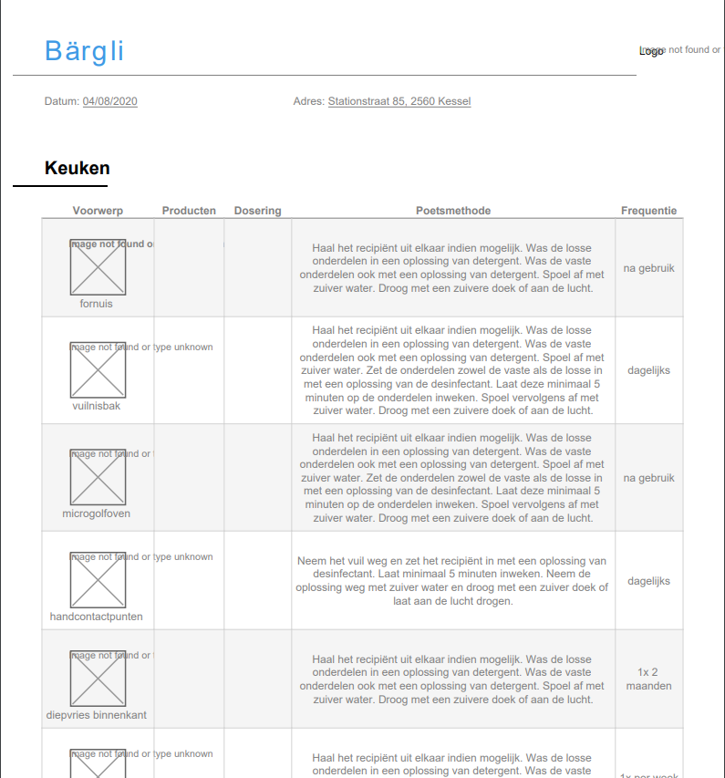

# Generate PDF

    GET client/{id}/pdf
    
Returns a downloadable pdf for a certain [Client]

## Parameters
### URI Parameters
Field | Data Type | Required | Description
--- | --- | --- | ---
id | integer | Y | Unique identifier

## Example
### Request

    GET https://hygieia.be/api/v1/client/4/pdf

### Response
downloadable PDF

[Client]: ../clients/README.md