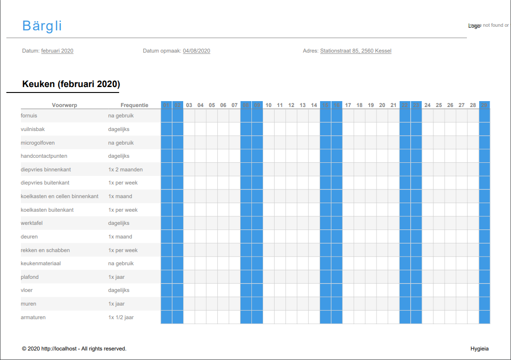

# Generate Table

    GET client/{id}/tabel/{year}/{month}
    
Returns a downloadable pdf for a certain [Client] |monthly|

## Parameters
### URI Parameters
Field | Data Type | Required | Description
--- | --- | --- | ---
id | integer | Y | Unique identifier
year | integer | Y | The year you wish to have a table for
month | integer | Y | The month you wish to have a table for

## Example
### Request

    GET https://hygieia.be/api/v1/client/4/tabel/2020/2

### Response
downloadable PDF

[Client]: ../clients/README.md