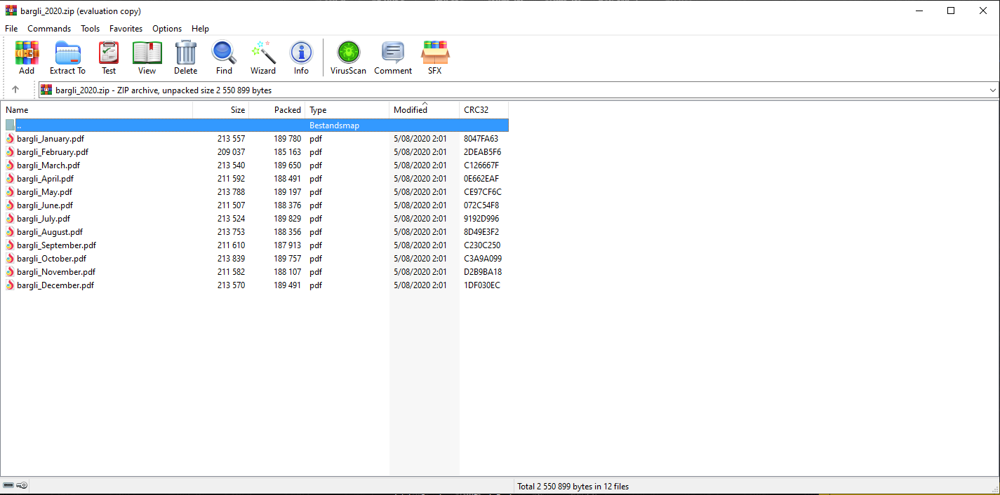
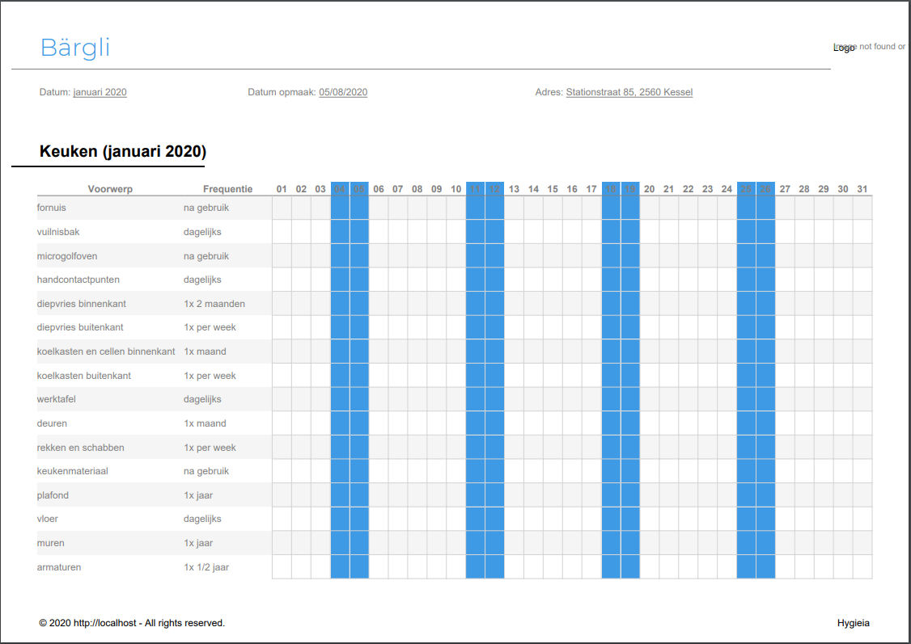

# Generate Tables

    GET client/{id}/tabels/{year}
    
Returns a downloadable zip with pdf's for a certain [Client] |yearly|

## Parameters
### URI Parameters
Field | Data Type | Required | Description
--- | --- | --- | ---
id | integer | Y | Unique identifier
year | integer | Y | The year you wish to have a table for

## Example
### Request

    GET https://hygieia.be/api/v1/client/4/tabels/2020

### Response
downloadable zip PDF's

[Client]: ../clients/README.md